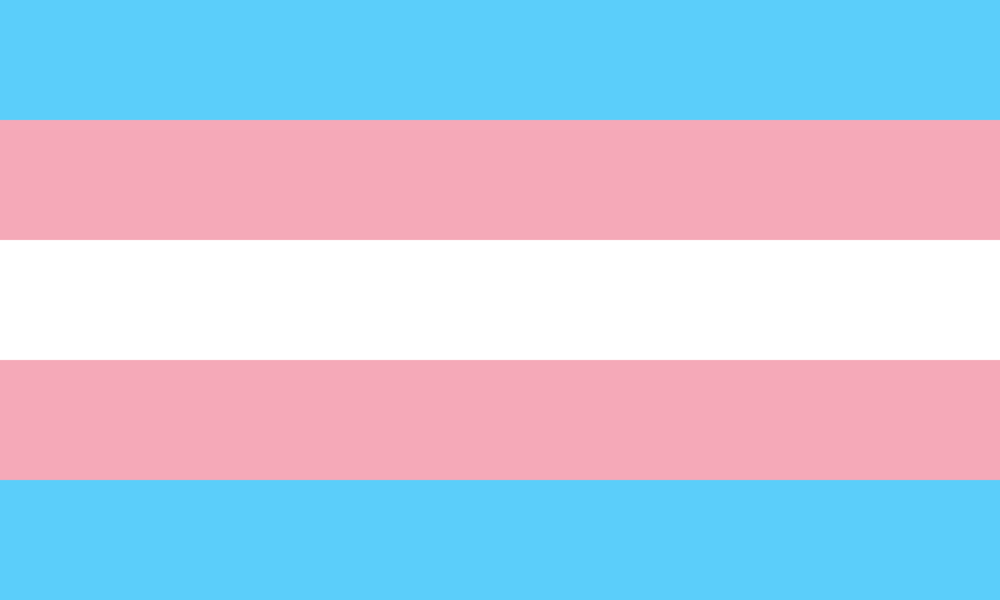

# FemArch



# Install

1. Flash an Arch ISO using Balena Etcher (or a custom tool that will probably come soon)
2. Connect to the internet using `iwctl` (or another tool for networking)
3. Format your disks using `cfdisk` or `fdisk`, FemArch's disk mapping is:
```txt
sda1: boot/efi (recomended 1 GB)
sda2: swap (recomended double of ram)
sda3: root (recomended rest of disk/disks)
```
4. Run the following command: `curl https://raw.githubusercontent.com/teker821/femarch/main/femarch-1.sh | sh`
5. After that finishes, run: `curl https://raw.githubusercontent.com/teker821/femarch/main/femarch-2.sh | sh` (note: you can stop here. But if you do, then it's not really FemArch)
6. `nmcli device wifi connect {NETWORK_NAME} password {NETWORK_PASS}` (plz replace those two standouts with your network name and password)
7. `curl https://raw.githubusercontent.com/teker821/femarch/main/femarch-3.sh | sh`
8. Follow along :3